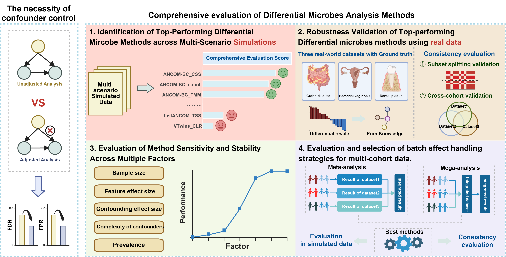

# Benchmarking Confounder-aware Differential Abundance (xConDA) Methods in Microbiome Data

## Workflow

## Introduction
We present a large-scale benchmark of 72 confounder-aware, end-to-end differential-abundance (DAA) strategies, assembled from six input schemes (five normalization approaches plus raw counts) and 14 statistical models. Across 250 simulation scenarios, we systematically evaluate precision and sensitivity to identify top performers. We then validate these strategies on three real-world datasets with approximate ground truth and assess cross-dataset consistency in 36 metagenomic datasets. We further probe robustness to sample size, prevalence, feature-effect magnitude, and the number, type, and strength of confounders. Beyond single-cohort evaluation, we further integrate the selected strategies with meta- and mega-analysis frameworks plus batch-effect correction, evaluating both simulated batch-affected settings and real cohorts to recommend effective, batch-robust DAA pipelines.

We also provided a DAA strategy benchmarking pipeline that helps researchers choose an optimal strategy and integration framework for their datasets, and then execute the selected methods end to end to obtain robust differential microbes. A step-by-step tutorial with sample data covers installation, setup, required inputs, key parameters, and output interpretation for quick, reproducible use. The pipeline is also available on the xConDA webserver.

